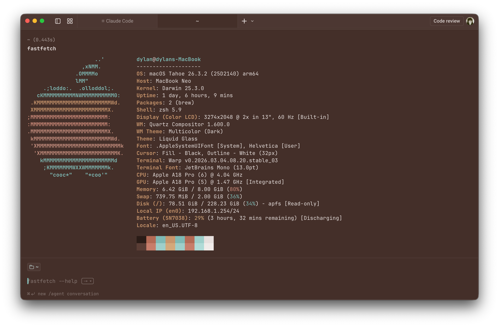

# Warm Clay — Warp Terminal Theme

A warm, earthy color theme for the Warp terminal app.

## Overview

This repository contains a custom Warp terminal theme called **Warm Clay**. The theme is provided as a YAML file:

- [warm_clay.yaml](warm_clay.yaml#L1)

## Installation

1. Open Warp and go to Preferences → Appearance → Themes (or Themes/Appearance settings).
2. Choose **Import** and select the `warm_clay.yaml` file from this repository.
3. Activate the imported theme.

## Preview

The screenshot at the top shows the theme applied in Warp. If the image does not display, add a file named `screenshot.png` to the repository root.

## Notes

- The YAML file contains color tokens for normal and bright terminal colors, plus foreground/background values.
- If you'd like, I can add the screenshot image into the repo — upload it here or tell me to fetch it and I'll add it.

---

Created with ♥ for Warp users who prefer a cozy, muted palette.
